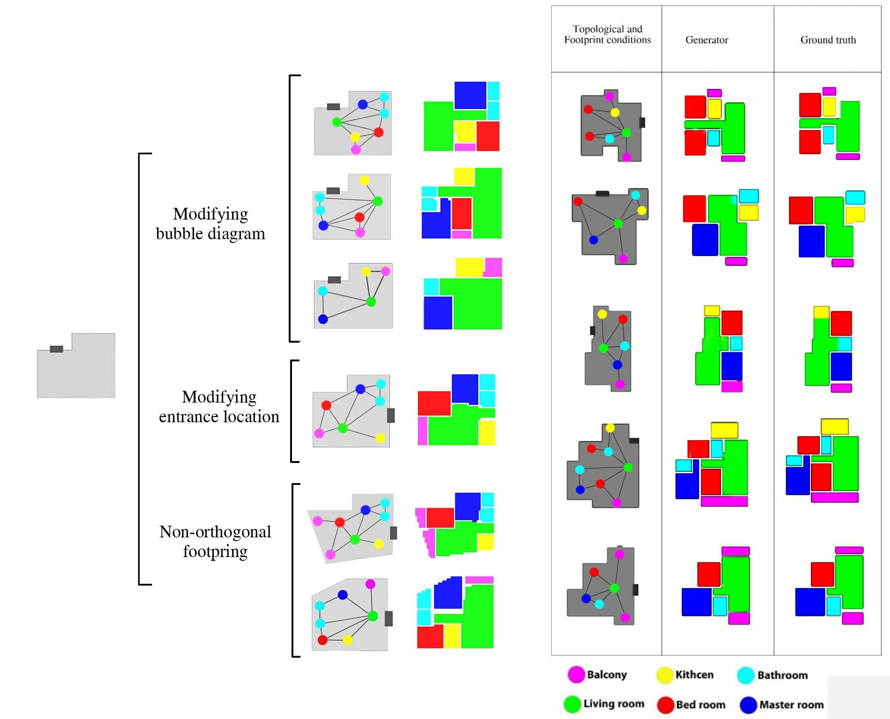

# Graph2Layout
A novel deep learning model is provided in this project to aid designers in creating the spatial arrangement of residential plans.
The building design process may be considerably accelerated by automating space allocation. This research aims to provide a platform
that allows architects to construct spatial layouts using deep learning algorithms while preserving high degrees of control over the outcomes.
The findings demonstrate that the suggested method can develop spatial arrangement solutions using fixed boundaries and established topological requirements.

The user interface for this project was created using the grasshopper 3d plugin and Rhinoceros software. Also, a set of GH components has been provided to assist the designers in interacting with the algorithm.
In the presented workflow, the user defines a bubble diagram and a building boundary in rhinoceros software using predefined components, feeds them to the DL model, and receives a vectorized space layout design inside the rhinoceros environment.

The Graph2Layout paper is now being reviewed, and once published, all scripts and explanations will be made available for further study improvements. The following pictures depict some of the algorithms' created solutions.

